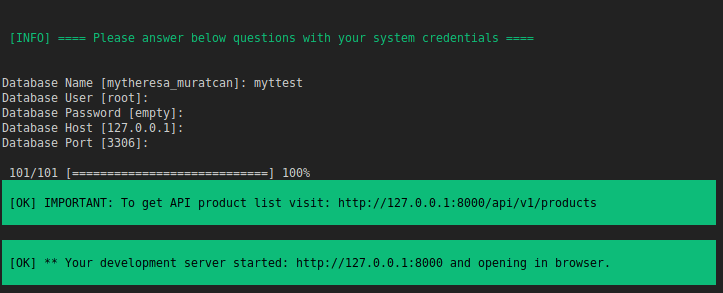

<h2>Case Project</h2>

<ul>
    <li><a href="#reqs">Requirements</a></li>
    <li><a href="#installation">Installation</a></li>
    <li><a href="#summary">Summary</a></li>
    <li><a href="#tests">Running Test</a></li>
</ul>
 

    <h4>Requirements</h4>
    <ul>
        <li>PHP >= 8.1 </li>
        <li>Local Development Server</li>
        <li>Symfony CLI </li>
        <li> Make Tool ( Optional )</li>
    </ul>

    <h4>Installation</h4>
    
You can run <code>php /bin/console app:install</code> to start installation process and you must answer the questions in opened terminal screen.

    
    
If you have "make tool" to run Makefile file, you can run <code>make install-app</code> instead of above command.

    
To get products collection after installation step, visit: http:/127.0.0.1:8000/products

    

        <h4>What we expect: </h4>
         

            You must take into account that this list could grow to have 20.000 products.
            The prices are integers for example, 100.00€ would be 10000.
            You can store the products as you see fit (json file, in memory, rdbms of choice)
        

        <ul>
            <li>
                Code structure/architecture must fit this use case, as simple or as complex needed to complete what is asked for.
            </li>
            <li>
                Tests are a must. Code must be testable without requiring networking or the filesystem. Tests should be runnable with 1 command.
            </li>
            <li>The project must be runnable with 1 simple command from any machine.</li>
            <li>Explanations on decisions taken</li>
        </ul>
         

            <h4>Given That: </h4>
            <ul>
                <li>Products in the boots category have a 30% discount.</li>
                <li>The product with sku = 000003 has a 15% discount.</li>
                <li>When multiple discounts collide, the biggest discount must be applied.</li>
                <li>Provide a single endpoint</li>
            </ul>
        

         

            <h4>Product Model: </h4>
            <ul>
                <li>price.currency is always EUR.</li>
                <li>When a product does not have a discount, price.final and price.original should be the   same number and discount_percentage should be null.</li>
                <li></li>
                <li>When a product has a discount price.original is the original price, price.final is the amount with the discount applied and discount_percentage represents the applied discount with the % sign.</li>
            </ul>
        

    

    <h4>Running Tests</h4>
    <code>php bin/phpunit</code>

